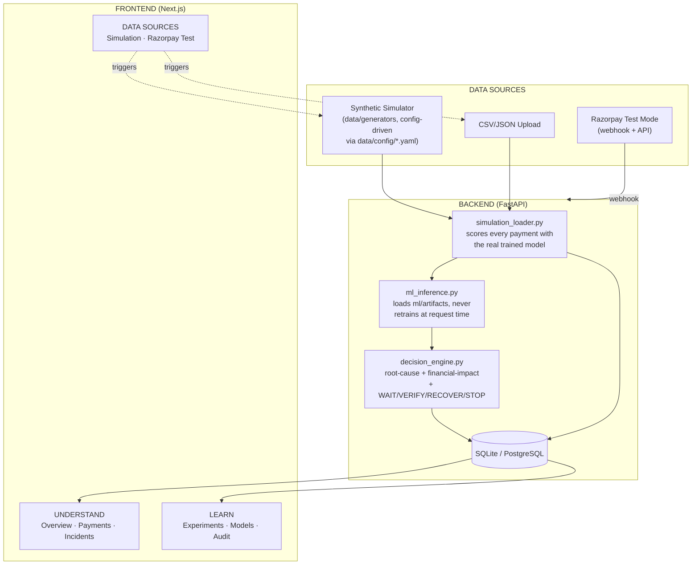

# Payment Truth

**Know the payment truth before you act.**

Built for **Razorpay AI Buildathon 2026 — Track 3: AI Revenue Recovery**.

> Track 3's own bar: *"Don't just identify the problem. Show measured
> money recovered across a batch, with compliant escalation, stopping
> rules, and an audit trail."*

Payment Truth closes that exact loop: detect revenue at risk from
payment-state uncertainty → diagnose the root cause with evidence → run
it through a bounded, auditable decision policy (`WAIT` / `VERIFY` /
`RECOVER` / `STOP` — never an open-ended action) → measure the actual
result against a naive baseline on a real batch (`experiments/revenue_protection/`).

The ML system is trained and evaluated on a domain-specific synthetic event
simulator with an explicit **true-world** vs **observed-world** separation, and its
integration is additionally validated against the Razorpay Test Mode API and
webhooks. It does **not** have access to Razorpay production data, and no numbers
in this repository claim measured production accuracy or production financial
savings — everything is labeled `SIMULATION` / `SYNTHETIC` / `ESTIMATED` /
`VERIFIED` where it applies.

**Two docs written specifically for this submission's judging criteria:**
[`docs/AI_JUDGMENT.md`](docs/AI_JUDGMENT.md) — exactly where and why ML,
deterministic rules, and an LLM are each used, and [`docs/FAILURE_RECOVERY.md`](docs/FAILURE_RECOVERY.md) —
a dated log of real bugs found by actually running the system, and how each was fixed.

## The core idea

> **What is most likely true about this payment right now, and what is the safest
> next action?**

```
TRUE WORLD  ──▶ EVENT GENERATION ──▶ EVENT DELIVERY ──▶ OBSERVED WORLD
                                                              │
                                                              ▼
                                                       ML PREDICTION ──▶ DECISION
                                                              │
                                                    (later) GROUND TRUTH
                                                              │
                                                        EVALUATION
```


A payment can look failed to the merchant while the true payment is still on its
way to being captured (late capture), or a webhook can arrive duplicated or out
of order. Payment Truth predicts the eventual state from only what was knowable
at that moment, and separately measures whether that prediction was right once
the truth is known.

## Quickstart (Simulation Mode — no credentials required)

```bash
git clone https://github.com/RAJARYANSINGH0059/payment-truth.git
cd payment-truth
docker compose up --build
```

- Frontend: http://localhost:3000
- Backend docs: http://localhost:8000/docs
- Health check: http://localhost:8000/health

A committed demo dataset (`data/demo/*.csv`) and a pretrained model
(`ml/artifacts/*.joblib`) ship in the repo, so the app is usable immediately.

## Local development (without Docker)

```bash
# Backend
cd backend
pip install -r requirements.txt
uvicorn app.main:app --reload --port 8000

# Frontend (separate terminal)
cd frontend
npm install
npm run dev
```

## Regenerating data / retraining the model

```bash
python scripts/generate_dataset.py --payments 20000 --seed 42 --sim-days 30
python ml/pipeline/train.py --data data/demo --out ml/artifacts
python ml/pipeline/incident_detector.py --data data/demo --out ml/artifacts
```

`--seed` + `--config` (baked into a config hash) make generation fully
reproducible. See `data/schemas/leakage_columns.py` for the columns that are
forbidden as model features — `train.py` asserts against this list before
fitting anything.

## Deploying for free

**Recommended combo: Render (backend) + Vercel (frontend).** Both have genuine
free tiers with no credit card required. Total cost: ₹0.

Why this split instead of both on Render: Render's free web services sleep
after 15 minutes idle and take ~30-60s to wake up — fine for a backend API,
annoying for the page judges/users actually look at. Vercel's free Hobby
tier serves Next.js natively (no cold start for static/edge content) and
costs nothing either. Render's free managed Postgres also expires after 30
days, so this deploy intentionally skips it and runs on SQLite instead (see
the comment in `render.yaml`) — the data resets on redeploy/spin-down, which
is fine for a demo but not for production.

### 1. Backend → Render

1. Go to https://render.com → sign up with GitHub (no card needed).
2. **New +** → **Blueprint** → connect your `payment-truth` repo. Render
   reads `render.yaml` from this repo automatically and provisions the
   `payment-truth-api` web service on the **Free** plan.
   - If you'd rather not use the Blueprint flow: **New +** → **Web Service**
     → connect the repo → Runtime: **Docker** → Dockerfile path:
     `backend/Dockerfile` → Docker context: `.` (repo root) → Instance type:
     **Free**.
3. Leave `RAZORPAY_KEY_ID` / `RAZORPAY_KEY_SECRET` / `RAZORPAY_WEBHOOK_SECRET`
   blank for now — the app runs fine in Simulation Mode without them
   (`/health` will just report `"razorpay": "not_configured"`).
4. Deploy. Render gives you a URL like `https://payment-truth-api.onrender.com`.
5. Confirm it worked: open `https://<your-url>/health` in a browser — you
   should see `{"status": "ok", ...}`. First load may take ~30-60s if the
   service had spun down.

### 2. Frontend → Vercel

1. Go to https://vercel.com → sign up with GitHub (no card needed).
2. **Add New** → **Project** → import the same `payment-truth` repo.
3. Set **Root Directory** to `frontend` (important — Vercel needs to build
   from that subfolder, not the repo root).
4. Framework preset should auto-detect as **Next.js**.
5. Before deploying, add an environment variable:
   `NEXT_PUBLIC_API_URL` = the Render URL from step 1
   (e.g. `https://payment-truth-api.onrender.com`).
6. Deploy. Vercel gives you a URL like `https://payment-truth.vercel.app` —
   that's your public demo link.

### USER ACTION REQUIRED checklist

```
ACTION: Sign up at render.com with GitHub, deploy via Blueprint (render.yaml)
WHERE:  render.com dashboard
VALUE:  no values needed to start — Razorpay fields can stay blank
WHEN COMPLETE: send me the resulting *.onrender.com URL

ACTION: Sign up at vercel.com with GitHub, import repo with Root Directory=frontend
WHERE:  vercel.com dashboard
VALUE:  NEXT_PUBLIC_API_URL = your Render backend URL from the step above
WHEN COMPLETE: send me the resulting *.vercel.app URL
```

Once both URLs exist, tell me and I'll walk through the Razorpay Dashboard
webhook step (which needs the public Render URL to point at).

## Enabling Razorpay Test Mode

Simulation Mode needs nothing. To exercise the real Razorpay Test integration:

1. **USER ACTION REQUIRED** — Razorpay Dashboard → Settings → API Keys → generate
   a **new** Test Mode key secret (the previously shared key is considered
   compromised and must not be reused). Put it in your environment as
   `RAZORPAY_KEY_SECRET`.
2. **USER ACTION REQUIRED** — deploy the backend somewhere with a public HTTPS URL
   (Razorpay cannot call `localhost`). `render.yaml` in this repo is ready for
   Render; set the Razorpay env vars there as private values.
3. **USER ACTION REQUIRED** — Razorpay Dashboard → Webhooks → add
   `https://<your-backend>/api/webhooks/razorpay`, enable
   `payment.authorized`, `payment.captured`, `payment.failed`, `order.paid`, and
   copy the generated webhook secret into `RAZORPAY_WEBHOOK_SECRET`.
4. Once both secrets are set, `/api/razorpay/status` reports `connected`, and the
   **Razorpay Test** page's "PAY WITH RAZORPAY TEST MODE" button creates a real
   ₹999 Test Mode order.

Until those three steps are done, `GET /health` reports
`"razorpay": "not_configured"` and the rest of the app keeps working normally —
Razorpay being unset is never a startup failure.

## Architecture

### System flow



### Repository structure

```
payment-truth/
├── data/
│   ├── config/               # default.yaml, stress.yaml, demo.yaml, unseen_test.yaml
│   ├── schemas/leakage_columns.py   # forbidden model-feature columns
│   ├── generators/generate_dataset.py  # true-world/observed-world simulator
│   └── demo/                 # committed small demo dataset + incidents_truth.csv
├── ml/
│   ├── pipeline/train.py            # baselines + XGBoost + calibration + SHAP
│   ├── pipeline/incident_detector.py # rule baseline + Isolation Forest
│   └── artifacts/                   # committed trained model + metrics
├── experiments/               # formal, reproducible evaluation scripts
│   ├── unseen_incident/run.py       # generalization test (spec section 4-7)
│   ├── incident_memory/run.py       # memory A/B test (spec section 8-10)
│   └── revenue_protection/run.py    # naive vs Payment Truth A/B (spec section 11-14)
├── backend/
│   └── app/
│       ├── main.py                  # FastAPI app, /health
│       ├── decision_engine.py       # root-cause + financial-impact + WAIT/VERIFY/RECOVER/STOP
│       ├── simulation_loader.py     # scores generated/imported data with the real model
│       ├── prediction_evaluation.py # Prediction vs Reality verdict computation
│       ├── historical_similarity.py # structured incident-similarity matching
│       ├── llm_explain.py           # LLM explanation layer + deterministic fallback
│       ├── webhook_utils.py         # Razorpay signature validation + normalization
│       ├── razorpay_client.py       # official Razorpay SDK wrapper
│       ├── ml_inference.py          # loads ml/artifacts, never retrains at request time
│       └── routers/                 # split by responsibility — see routers/ARCHITECTURE.md
│           ├── payments.py · incidents.py · dashboard.py
│           ├── models_metrics.py · simulation.py
│           ├── experiments.py · razorpay.py · webhooks.py
├── frontend/                  # Next.js, nav grouped UNDERSTAND / LEARN / DATA SOURCES / SYSTEM
├── docs/
│   ├── ASSUMPTIONS.md         # synthetic vs documented-Razorpay-behavior distinction
│   ├── ml-results.md          # every reported number, reproducible
│   └── dataset.md             # data methodology
├── tests/                     # pytest — webhook signature/dedup, decision engine, leakage,
│                               #   simulation-loader end-to-end, prediction verdicts, config-driven generation
└── .github/workflows/ci.yml
```

See `backend/app/routers/ARCHITECTURE.md` for the reasoning behind the
router split and the rule for where a new endpoint should go.

## Current model results (on the committed demo dataset)

See `/models` in the running app, or `ml/artifacts/metrics.json` directly —
numbers are never hardcoded here. As of the last training run on this repo's
demo dataset: XGBoost (calibrated) clears the rule-based baseline on macro F1
and is evaluated on both a payment-level holdout and a time-based holdout.
The incident detector's precision/recall are reported honestly and are
noticeably weaker than the payment-state model at this dataset's traffic
volume — that's a real limitation, not a bug, and is visible on the Models
page rather than hidden.

## What this is not

Not a fraud platform, not an RTO tool, not a reconciliation tool, not a generic
payment-monitoring dashboard, not a chatbot. Every feature here answers one
question: is this payment's true state currently uncertain, and if so what
should you do about it.

## Security

- No secrets are committed. `.env.example` ships with empty values only.
- Webhook signature validation is mandatory — the endpoint returns 503 if
  `RAZORPAY_WEBHOOK_SECRET` isn't set, and 400 on an invalid signature.
- Secrets are never displayed in the UI, logs, or API responses (see
  `/api/razorpay/status`, `/settings`).
